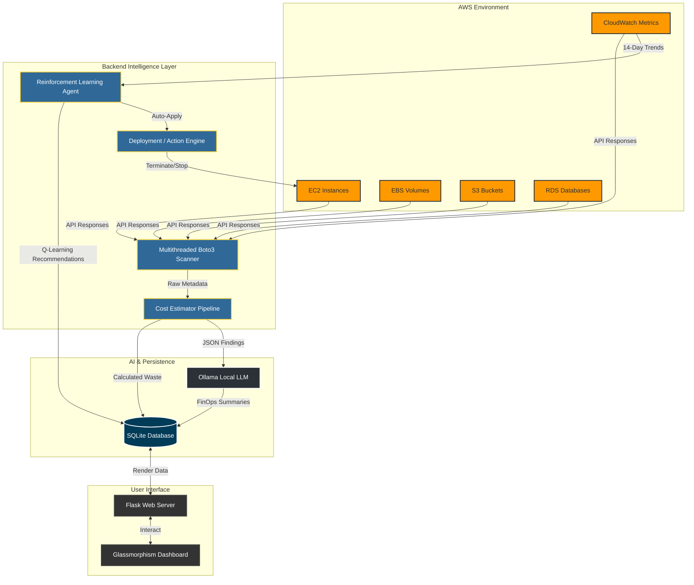
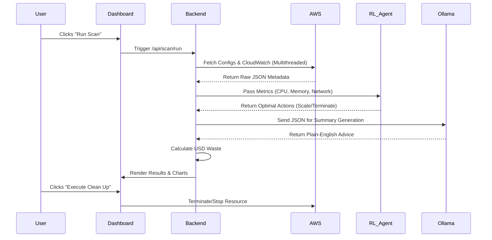
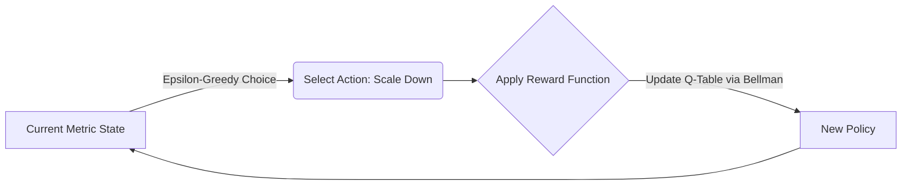

<div align="center">

# AWS Smart Cost Optimizer (CostPilot AI) ☁️💰

[](https://www.python.org/downloads/)
[](https://flask.palletsprojects.com/)
[](https://aws.amazon.com/sdk-for-python/)
[](https://opensource.org/licenses/MIT)

*A comprehensive, AI-powered Financial Operations (FinOps) platform designed to automatically identify, quantify, and remediate wasted cloud spend across your AWS infrastructure.*

[System Overview](#-system-overview) • [Working of the Project](#-working-of-the-project) • [RL Engine](#-reinforcement-learning--forecasting) • [LLM Advisor](#-local-llm-finops-advisor) • [Onboarding Guide](#-user-onboarding-guide)

</div>

---

## 🌐 System Overview

**CostPilot AI** bridges the gap between rapid engineering deployment and strict financial accountability. In modern enterprise cloud environments, "Cloud Waste" occurs when developers provision instances, databases, or storage volumes for testing, and fail to decommission them. 

Instead of relying on expensive SaaS platforms that export your sensitive architectural metadata to third-party servers, CostPilot AI operates entirely within your network. It connects directly to your AWS environment via the Boto3 SDK, utilizes advanced **Reinforcement Learning (RL)** to analyze metric trends, and leverages **Local Large Language Models (LLMs)** like Ollama to translate complex infrastructure json into plain-English executive summaries.

---

## 🏗️ System Architecture Flowchart

The system is separated into three distinct tiers: **Data Collection**, **Intelligence Processing**, and **Presentation**.



---

## 🌟 Core Features

- **🔍 Automated Multithreaded Scanning:** Scans across multiple AWS regions in parallel (cutting audit times by 80%) to detect unattached EBS volumes, stopped EC2 instances, unused Elastic IPs, orphaned snapshots, and unused Lambda functions.
- **🧠 Reinforcement Learning Optimizer:** Analyzes historical CloudWatch metrics and uses Q-learning to recommend right-sizing.
- **🤖 Local AI FinOps Advisor:** Integrates with local AI (Ollama) to ensure sensitive cloud data never leaves your network while still providing ChatGPT-like summaries.
- **📊 Glassmorphism Web Dashboard:** A responsive, sleek Flask-based UI providing real-time ROI trends, filterable tables, and one-click remediation.
- **🚨 Budget Alerting:** SMTP-integrated engine that fires automated emails when projected waste exceeds limits.
- **🛡️ Dry-Run Safety Engine:** Test cleanup operations safely. No resources are terminated unless explicitly authorized.

---

## ⚙️ Working of the Project

The execution of CostPilot AI follows a strict pipeline to ensure safety and accuracy.



1. **Authentication:** The backend validates IAM credentials via `STS GetCallerIdentity`.
2. **Concurrent Auditing:** A `ThreadPoolExecutor` spawns workers for each active AWS region. They pull resource states and 14-day CloudWatch averages.
3. **Cost Estimation:** Idle resources are mapped against a pricing dictionary to calculate exact `$USD` waste per month.
4. **Intelligence Processing:** The data is passed to the RL agent for action predictions, and to the Ollama LLM for narrative generation.
5. **Persistence:** The final report is saved to SQLite to build historical charts on the dashboard.

---

## 🧠 Reinforcement Learning & Forecasting

Rather than using rigid, hardcoded thresholds (e.g., "Delete if CPU < 5%"), CostPilot AI utilizes a true Reinforcement Learning (RL) algorithm.

### The Mathematics of the Agent
The system models cloud infrastructure as a **Markov Decision Process (MDP)**.
* **State Space ($S$):** A 3D matrix combining CPU Utilization, Memory Pressure, and Network I/O buckets.
* **Action Space ($A$):** `[Scale_Down, Maintain, Scale_Up]`.
* **Reward Function ($R$):** The agent is highly penalized for making changes during peak load (to prevent downtime) and penalized for maintaining high-cost instances with low CPU.


The agent continuously updates its `Q-Table` locally. Over time, it learns the specific traffic patterns of *your* enterprise, determining when it is safe to shut down an environment vs when a server is just experiencing a temporary dip in traffic.

---

## 🤖 Local LLM FinOps Advisor

Cloud metadata is incredibly dense. A JSON response for a single EC2 instance can be hundreds of lines long. CostPilot AI integrates with **Ollama** to process this data locally.

**How it works:**
1. The Boto3 scanners condense the findings into a minimal dictionary.
2. The Backend constructs a prompt: *"Act as an executive FinOps advisor. Here is the waste data: {data}. Provide 3 actionable bullet points."*
3. This prompt is sent to the local Ollama daemon (running `phi3` or `llama3`).
4. Because Ollama runs on your local CPU/GPU, **your proprietary AWS architecture is never sent to OpenAI or any third-party cloud**, ensuring absolute data privacy.

---

## 📋 Initial Requirements

Before setting up CostPilot AI, ensure you have the following prerequisites configured on your system:

1. **Python:** Version `3.10` or higher.
2. **AWS Account:** An active AWS account.
3. **IAM User Credentials:** Programmatic access keys (`AWS_ACCESS_KEY_ID` and `AWS_SECRET_ACCESS_KEY`). Ensure the user has the permissions listed in the [IAM Permissions](#-iam-permissions-required) section.
4. **Ollama (Optional but Highly Recommended):** Installed locally to utilize the AI Advisor feature.

---

## 🛠️ User Onboarding Guide

Follow these simple steps to get the project running and analyzing your AWS account.

### Step 1: Clone the Repository
Pull the source code to your machine.
```bash
git clone https://github.com/Kanishkchahar/cloud-cost-optimizer-for-AWS.git
cd cloud-cost-optimizer-for-AWS
```

### Step 2: Configure Environment Variables
Copy the template environment file:
```bash
cp .env.example .env
```
Open `.env` in any text editor and insert your AWS credentials:
```env
AWS_ACCESS_KEY_ID=your_access_key
AWS_SECRET_ACCESS_KEY=your_secret_key
AWS_DEFAULT_REGION=ap-south-1
```
> **Security Note:** Your `.env` file is ignored by Git to prevent accidental credential leaks.

### Step 3: Install and Start Local AI (Ollama)
Download and install [Ollama](https://ollama.com/download). Once installed, open a new terminal window and run:
```bash
ollama pull phi3
ollama serve
```

### Step 4: Launch the Platform
Install the required python packages and start the dashboard!
```bash
pip install -r requirements.txt
python main.py --dashboard
```
Open `http://127.0.0.1:5000` in your web browser. Create an account, log in, and click **Run Scan**!

---

## 💻 Running Locally for Devs

If you are a developer looking to contribute, utilize the CLI, or tweak the RL agent, follow this setup:

### 1. Virtual Environment Setup
```bash
python -m venv venv
# Windows:
venv\Scripts\activate
# macOS/Linux:
source venv/bin/activate

pip install -r requirements.txt
```

### 2. Utilizing the CLI
The core engine can be utilized entirely from the terminal, bypassing the Flask server. This is excellent for CI/CD integration.
```bash
# Basic scan - find out what's wasted
python main.py --scan

# Scan and request AI recommendations in the terminal
python main.py --scan --ai

# Dry-run cleanup (Safe preview of deletions)
python main.py --scan --dry-run

# Run the autonomous RL optimizer
python main.py --optimize
```

### 3. Tuning the Reinforcement Learning Agent
Developers can tune the RL agent's hyperparameters directly in the `.env` file.
```env
OPTIMIZER_LOOKBACK_DAYS=14
OPTIMIZER_CPU_LOW_PCT=15.0
OPTIMIZER_MIN_CONFIDENCE=0.75
AUTO_APPLY_OPTIMIZATIONS=false
```

---

## 📁 Project Directory Structure

```text
cloud-cost-optimizer-for-AWS/
├── main.py                  # CLI & Web App Entry Point
├── config.py                # Core configuration & thresholds
├── .env                     # Secrets and Environment Config
├── requirements.txt         # Python dependencies
├── dashboard/               # Flask Web Application Layer
│   ├── app.py               # REST API Routes and Views
│   ├── static/              # Vanilla CSS (Glassmorphism) / JS
│   └── templates/           # HTML Views (Jinja2)
├── scanner/                 # AWS SDK Integration
│   ├── ec2.py               # Compute Scanner
│   ├── ebs.py               # Storage Scanner
│   └── s3.py                # Object Scanner
├── optimizer/               # Intelligence Layer
│   ├── pipeline.py          # Central data orchestrator
│   ├── rl_agent.py          # Q-Learning Mathematics
│   └── deployment_agent.py  # Safe action execution
├── analyzer/                # Data Processing Layer
│   ├── cost_estimator.py    # Pricing algorithms
│   └── ai_advisor.py        # Ollama HTTP interface
├── db/                      # Persistence Layer
│   └── database.py          # SQLite connections and schemas
```

---

## 🔒 IAM Permissions Required

To operate securely, the IAM user attached to this project must have the following minimum JSON policy applied in AWS IAM:

> [!WARNING]  
> If you intend to use the dashboard to delete resources, ensure the `Delete*` and `Terminate*` permissions are granted. If you only want auditing, remove those actions.

```json
{
  "Version": "2012-10-17",
  "Statement": [
    {
      "Effect": "Allow",
      "Action": [
        "ec2:Describe*",
        "ec2:StartInstances",
        "ec2:StopInstances",
        "ec2:TerminateInstances",
        "ec2:DeleteVolume",
        "ec2:ReleaseAddress",
        "ec2:DeleteSnapshot",
        "rds:Describe*",
        "rds:StopDBInstance",
        "rds:DeleteDBInstance",
        "s3:ListAllMyBuckets",
        "lambda:ListFunctions",
        "cloudwatch:GetMetricStatistics"
      ],
      "Resource": "*"
    }
  ]
}
```

---

## 🤝 Contributing
Contributions, issues, and feature requests are welcome!

## 📝 License
This project is open-source and available under the **MIT License**.
